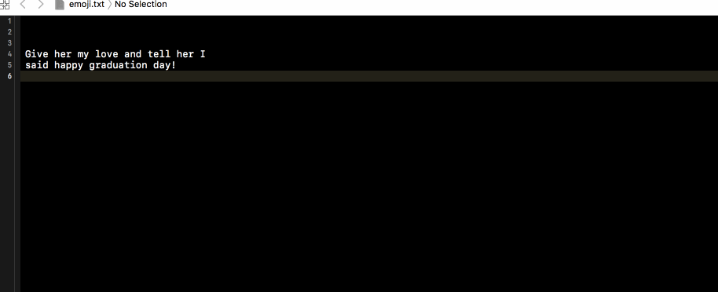

# EmojifySourceEditorExtension

This is a proof-of-concept implementation of the new Xcode Source Editor Extensions

> Note: The extension only converts "love", "happy" and "graduation" to corresponding emojis.

## How to use:

1. Download latest Xcode 8 - beta
2. Let it install additional system components
3. After it is installed, open terminal and execute `sudo /usr/libexec/xpccachectl`
4. Reboot your machine. This is required only for the first time
5. Open the project in Xcode 8 - beta and run the extension scheme. Fix code signing issues if there are any. Extensions and the app need to be signed properly.
6. Choose Xcode 8 - beta in "Choose an app to run" popup
7. A new instance of Xcode should be launched by now. Open any source file, "Emojify" entry is made in "Editor" menu
8. Choose the option from the menu and voilà

## Credits

Thanks to [Brandon Kobilansky](https://github.com/bkobilansky) for helping me in running the sample.
